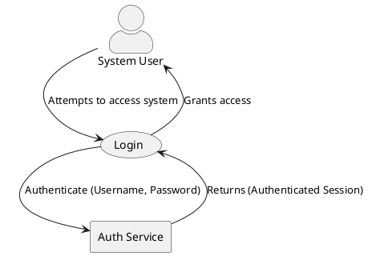

# Initial Design: Rust TOGAF IDL

## Introduction

This document outlines the initial design for a Rust-based TOGAF IDL (Interface Definition Language) within the `b00t` ecosystem. The primary goal is to establish a Single Source of Truth (SSOT) for architectural and business process definitions, using a `b00t` datum-based, Model-Based Systems Engineering (MBSE) approach. This IDL will facilitate the memoization (read/extract and write/insert) of PlantUML or similar BPMN tables, representing various types of requirements, roles, stakeholders, and skills. The design prioritizes idiomatic Rust and a DRY (Don't Repeat Yourself) convention.

## Core Concepts

### 1. Datum-Based Stereotypes

Architectural elements (Actors, Business Processes, Application Components, etc.) will be defined as `b00t` datums, stored in `.toml` files. Each `.toml` file will represent an instance of a TOGAF/BPMN "stereotype," capturing its properties and relationships.

**Example `Actor` Datum (`actor_system_user.actor.toml`):**

```toml
[b00t]
name = "System User"
type = "actor"
version = "1.0.0"
description = "A human user interacting with the b00t system."

[actor]
category = "Human"
roles = ["End User", "Operator"]
associated_skills = ["b00t-cli-usage", "basic-troubleshooting"]
lifecycle_phase = "Operational"

[relationships]
participates_in = [
    { type = "Business Process", name = "Login" },
    { type = "Business Process", name = "Execute Command" }
]
```

### 2. PlantUML Integration

The IDL will provide functionality to:
*   **Generate PlantUML:** Convert parsed TOML datums into PlantUML syntax, enabling the visualization of architectural diagrams and BPMN flows directly from the SSOT datums.
*   **[Future] Parse PlantUML:** (More challenging) Extract architectural elements and relationships from PlantUML diagrams and reflect them back into TOML datums, ensuring round-trip engineering capabilities.

### 3. Requirements Representation

The datum structure for each stereotype will include fields to explicitly define various types of requirements (e.g., functional, non-functional, security, data) and link them to relevant architectural elements. This ensures traceability and comprehensive analysis.

### 4. SSOT and DRY Principles

By centralizing architectural definitions in TOML datums, we achieve:
*   **Single Source of Truth:** All derived artifacts (PlantUML diagrams, documentation) originate from these datums.
*   **DRY:** Generation of diagrams and reports from datums eliminates manual duplication and ensures consistency.

## Proposed Rust Crate Structure (`b00t-togaf-idl`)

```
b00t-togaf-idl/
├── Cargo.toml
└── src/
    ├── lib.rs
    ├── datum/
    │   ├── mod.rs             # Defines traits/enums for all datum types
    │   ├── actor.rs           # ActorDatum struct (serde for TOML)
    │   ├── business_process.rs # BusinessProcessDatum struct
    │   └── ...                # Other TOGAF/BPMN stereotypes
    ├── plantuml/
    │   ├── mod.rs             # PlantUML generation/parsing logic
    │   ├── generator.rs       # Logic to generate PlantUML from datums
    │   └── parser.rs          # [Future] Logic to parse PlantUML to datums
    ├── model/
    │   ├── mod.rs             # Intermediate representation (decoupled from TOML/PlantUML)
    │   └── common.rs          # Common types/enums for model elements
    └── error.rs               # Custom error types
```

**`Cargo.toml` (Initial Dependencies):**

```toml
[package]
name = "b00t-togaf-idl"
version = "0.1.0"
edition = "2021"

[dependencies]
serde = { version = "1.0", features = ["derive"] }
toml = "0.8"
plantuml-parser = { git = "https://github.com/some-plantuml-parser", optional = true } # Placeholder
plantuml-generator = { path = "./plantuml-generator", optional = true } # Placeholder or custom
thiserror = "1.0" # For custom error types
```

## Example PlantUML Generation (Business Process)

**Given a `business_process_login.process.toml` datum:**

```toml
[b00t]
name = "Login"
type = "business_process"
version = "1.0.0"
description = "User authentication process."

[process]
owner = "Security Team"
inputs = ["Username", "Password"]
outputs = ["Authenticated Session"]
triggers = ["User attempts to access system"]
participants = [
    { type = "Actor", name = "System User" },
    { type = "Application Component", name = "Auth Service" }
]
```

**Generated PlantUML (Example Snippet):**



## Next Steps

1.  **Detailed Datum Schema Definition:** Elaborate on the TOML schema for key TOGAF/BPMN stereotypes.
2.  **PlantUML Generator Prototyping:** Begin implementing the Rust logic to generate PlantUML from simple datum definitions.
3.  **Error Handling:** Define a comprehensive error strategy.
4.  **Integration with `b00t-cli`:** Plan how this IDL will be exposed and used via the `b00t-cli`.
